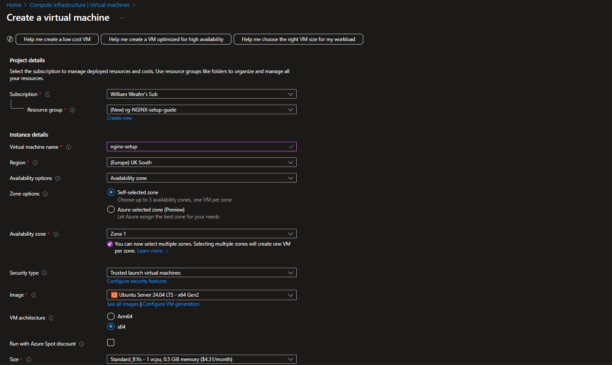
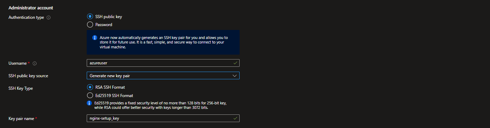
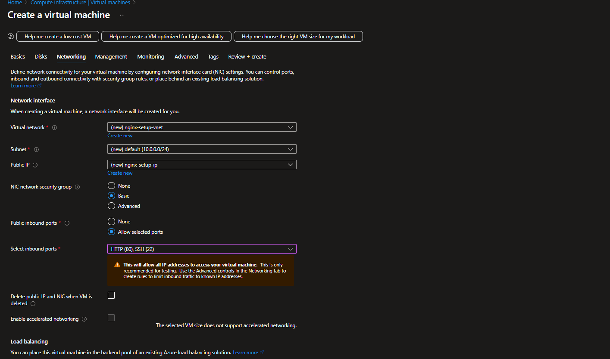
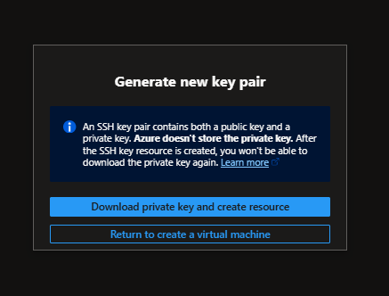
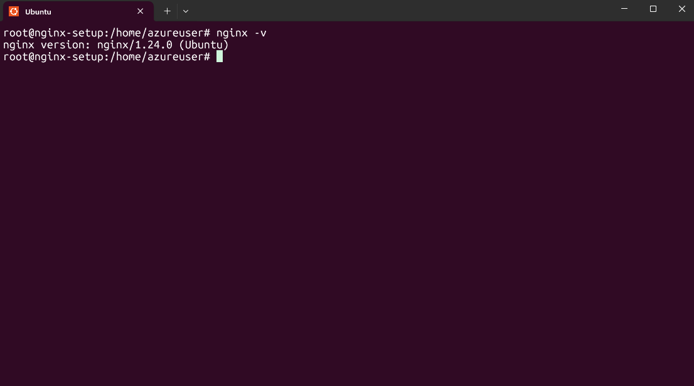
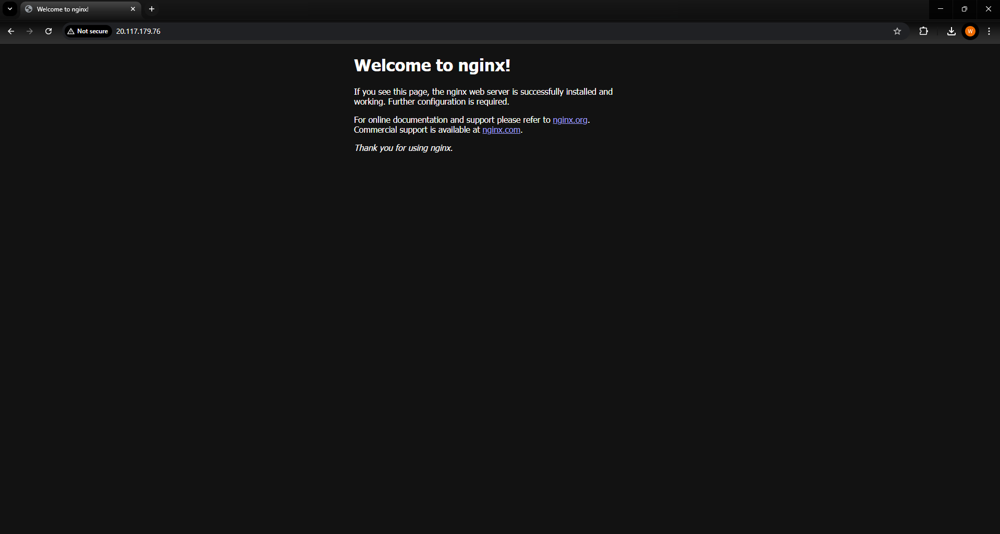

# Deploying NGINX on a Azure VM Step-by-Step Guide 🚀

In this guide i will walk you through the process on how i deployed a NGINX web server on a Azure VM. I will cover everything from setting up your networking configuration making sure your NGINX server is up and running. By the end of this guide, you'll have a fully functional NGINX server accessible via the internet!

## Introduction 📋

This project demonstrates how to deploy a NGINX server on a Azure VM, I will be covering key concepts like networking, SSH and server management. This guide is a valuable resource for both beginners and experienced developers!

## Things you need beforehand ✅

Before you start, make sure you have the following:

- An Azure account + subscription setup
- SSH client installed
- Some basic knowledge of Linux commands

## Step 1: Create a Azure Virtual Machine 🖥

First, you'll need to set up an Azure Virtual Machine (VM), a Virtual Network (VNet), and a subnet. This is crucial for managing your server's network and security settings.

Create a new resource group and edit your VM settings.
Here's a screenshot of my Virtual Machine settings:



Make sure to select RSA SSH Format so you can generate a key pair and change the username to your unique name, i will be using the default.



## Step 2: Networking Configuration 🌐

When setting up your virtual network and subnet, ensure they are correctly configured to allow traffic to your VM (HTTP, port 80).This involves managing Network Security Groups (NSGs) Azure’s built-in firewall that controls inbound and outbound traffic for your VM. Here's an example screenshot of my networking settings:



Note: You can restrict SSH access to only your IP for better security.

Make sure to select RSA SSH Format so you can generate a key pair.


## Step 3: Key Pair 🔐

Make sure to download your key pair, it should be a .pem file.



## Step 3: Connect to your VM 

Open your terminal and use the following command to SSH into your VM:
```bash
ssh -i "your-key.pem" username@your-VM-public-ip
```

## Troubleshooting Permissions 🚧

While running apt update, you might encounter a permission error. A common workaround (though not best practice) is to use sudo su to become the root user:

```bash
sudo su
```

This grants you the necessary permissions to perform administrative tasks. 

## Step 4: Update and Install NGINX 🛠

Now that you have root access, update your system and install NGINX:

```bash
apt update -y
apt install nginx -y
```

## Step 5: Verify NGINX Installation 🔍 

To verify the installation, run the following command:

```bash
nginx -v
```


Conclusion 🎉
Congratulations! You’ve successfully deployed an NGINX web server on Microsoft Azure. This guide covered essential steps, including setting up networking, configuring security, and installing software on a remote server.

If you followed the steps correctly, browsing to your VM’s public IP address should show this page:



FYI: I have deleted this project in Azure, i see you looking at the IP...🕵️

## Bonus Tip: Clean Up Your Azure Resources 🧹
If you're testing this deployment as a beginner or for learning purposes, remember to delete your Azure resources when you’re done to avoid unwanted charges. You can delete the entire resource group you created, which will remove the VM, networking components, and any related resources all at once.

In the Azure Portal:

- Go to Resource Groups

- Select the resource group you created for this project

- Click Delete resource group, and follow the prompts

Cleaning up is a good habit and helps keep your cloud environment organized and cost-efficient!


